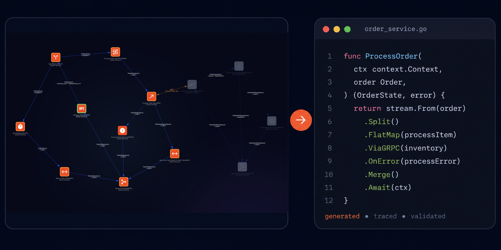

<div align="center">

# ServiceLib for C++

**The C++20/userver runtime powering C++ services generated by [Service Architect](https://www.gorundebug.com)**

[](https://isocpp.org/)
[](LICENSE)
[](https://userver.tech/)
[](https://opentelemetry.io/)
[](https://prometheus.io/)



</div>

---

## About

Service Architect is a visual designer and code generator for distributed systems. You draw a graph of services, typed pipelines, and connections; the designer generates the C++ workspace, userver components, transport adapters, configuration, observability wiring, and runtime graph.

This repository is the C++20 runtime used by that generated code. It preserves the observable stream, cancellation, lifecycle, configuration, and connector semantics of the Go reference implementation while using userver coroutines and transports.

> **The graph is the architecture. It runs the system and remains accurate by definition.**

ServiceLib is normally consumed through generated projects rather than assembled by hand.

→ **[Open Service Architect](https://www.gorundebug.com)**

---

## What The Runtime Provides

- Strongly typed stream graphs generated from the Service Architect model
- C++20 interfaces with userver coroutine-based execution
- Function-call, task-pool, priority-pool, and parallel call semantics
- HTTP, gRPC, Kafka, and local in-process connectors
- Deadlines, cancellation propagation, delay pools, and coordinated shutdown
- In-memory join state with rotating retention maps
- userver-backed metrics, structured logging, tracing, and status endpoints
- Layered YAML configuration with environment substitution and hot reload

Graph wiring and immutable runtime relationships are established once during startup. Request processing uses pre-resolved consumers and callers rather than rebuilding or looking up graph edges on the hot path.

---

## Execution Model

| Semantics | Behavior |
|---|---|
| `FunctionCall` | Invoke the next consumer directly; optionally dispatch asynchronously |
| `TaskPool` | Schedule work on a named bounded task pool |
| `PriorityTaskPool` | Schedule work using request priority |
| `Parallel` | Dispatch independently through userver's task processor |

The runtime keeps payload ownership explicit, propagates cancellation and deadlines across supported transports, and executes each delay callback exactly once whether its timer or cancellation wins.

An unhandled `std::exception` escaping a `TaskPool`, `PriorityTaskPool`,
`DelayPool`, or `ParallelCall` callback terminates the process with exit code 2.
Typed business failures still belong to result values or graph error branches.
`OperationCancelledError` (including `PoolCancelledError` and cancelled
SubStream calls), userver `WaitInterruptedException`, and
`TaskCancelledException` represent expected cancellation and are not fatal at
these callback boundaries. Synchronous function-call exception propagation is
unchanged.

Unhandled callback failures are fatal: standard exceptions terminate with exit
status 2, while non-standard thrown values (for example, `throw 42`) reach
userver's unconditional `AbortWithStacktrace` boundary and terminate via
`SIGABRT`. This also applies in Release; it is not a debug-only assertion.
The runtime does not catch userver's private cancellation unwinder. Expected
`OperationCancelledError`, `WaitInterruptedException` and `TaskCancelledException`
remain nonfatal, and typed business errors continue through their normal paths.
The subprocess regressions cover TaskPool, PriorityTaskPool, Delay and Parallel.

The HTTP sink intentionally retains a buffered response body (`Response::body`
is a `std::string`). Its business response handler runs after the complete body
has been received. This is an explicitly accepted difference from Go's
streaming response API: the installed userver streaming API does not expose
all post-header transport failures and does not publish headers before the
first body byte. ServiceLib does not patch userver or substitute a separate
HTTP transport to conceal these limitations.

---

## Operators

| Operator | Purpose |
|---|---|
| `Input` | Receive data from an external system |
| `Sink` | Send data to an external system |
| `Map` / `Filter` | Transform or conditionally pass values |
| `FlatMap` / `FlatMapIterable` | Expand a value into multiple outputs |
| `Process` / `Error` | Produce normal and error output streams |
| `KeyBy` | Partition values by key |
| `Join` / `MultiJoin` | Combine keyed streams |
| `Merge` / `Split` | Merge or fan out stream branches |
| `Case` / `When` | Route values conditionally |
| `Delay` | Deliver later or immediately on cancellation |
| `CycleLink` | Feed values back into the graph |

---

## Connectors

**Sources** — HTTP · gRPC (unary and streaming) · Kafka · local/custom

**Sinks** — HTTP · gRPC (unary and streaming) · Kafka · local/custom

HTTP and gRPC propagate stream identity, trace context, baggage, and remaining deadlines where supported. Process-local scheduling metadata, such as priority, stays local.

---

## Configuration And Hot Reload

Configuration is assembled from generated defaults, a base YAML document, an overrides YAML document, and environment substitutions. The C++ loader uses userver's periodic file watcher rather than filesystem notifications.

Reload is transactional: parsing, generated-config adaptation, runtime indexing, validation, and the service callback must succeed before the new snapshot is published. Failed candidates are logged and counted while the last valid configuration remains active. Task-pool settings can be updated without rebuilding the graph.

---

## Observability

The public runtime interfaces are backend-independent:

- `servicelib::metrics::Metrics`
- `servicelib::log::Logger`
- `servicelib::tracing::Tracing`

Production services use adapters from `servicelib/runtime/telemetry/userver`: metrics are registered in userver's statistics storage and exposed in Prometheus format, logs use userver's structured logger, and spans use userver tracing. Registering userver's OTLP logger component exports logs and traces through OTLP.

Request tracing is enabled by a non-empty `X-Trace`/`x-trace` marker or an already sampled W3C remote parent. Without either signal, ServiceLib avoids creating recording request, operator, pool, source, or sink spans, even if userver has an ambient transport span.

Tests can inject `TestMetrics`, `TestLog`, and `TestTracing`. No-op implementations remain available when observability is intentionally disabled.

---

## Repository Contract

This repository contains the runtime framework:

- public headers in `include/servicelib`
- framework tests in `tests`
- task-pool benchmarks in `benchmarks`
- CMake package metadata in `cmake`

userver is an external dependency, not a submodule. Generated services pin and build the userver version they require.

---

## Consuming From CMake

When userver targets already exist:

```cmake
add_subdirectory(path/to/cppservicelib)

target_link_libraries(my_service PRIVATE
    servicelib::servicelib
    userver-core)
```

An installed package can be consumed with:

```cmake
find_package(servicelib CONFIG REQUIRED)
find_package(userver CONFIG REQUIRED COMPONENTS core)
target_link_libraries(my_service PRIVATE
    servicelib::servicelib
    userver::core)
```

---

## Testing

Tests require userver core, gRPC, Kafka, and utest targets. The reproducible Docker-first command accepts userver as an independent BuildKit context:

```sh
USERVER_SOURCE_CONTEXT=../userver ./scripts/test.sh
```

Set `SERVICELIB_BUILD_BENCHMARKS=ON` to build the task-pool benchmark.

---

## Related Projects

| Project | Description |
|---|---|
| [Service Architect](https://www.gorundebug.com) | Visual graph designer and code generator |
| [Go runtime](https://github.com/gorundebug/servicelib) | Semantic reference implementation |
| [C++ example](https://github.com/gorundebug/cppexample) | Generated, runnable C++ services |
| [Service generator](https://github.com/gorundebug/servicegen) | Cross-language code generator |

---

## Releases

Consumers depend on immutable semantic-version tags. A release tag must point to the exact runtime revision selected by `servicegen`; generated projects must not track `main`.

---

## License

BSD-3-Clause. See [LICENSE](LICENSE).

---

## Contacts

| | |
|---|---|
| Website | [gorundebug.com](https://www.gorundebug.com) |
| Email | [serlex777@gmail.com](mailto:serlex777@gmail.com) |
| Telegram | [t.me/+31qMliw-DeI3M2M6](https://t.me/+31qMliw-DeI3M2M6) |
## Service-local SubStream

`servicelib::ISubStream<T, R>` exposes a callable graph inside one service.
Generated typed getters such as `getLookupSubStream()` let custom makers
inject only the handles their business functions need. Handles are bound after
graph construction; do not invoke them in a maker or after the service is gone.
Weak generated handles prevent ownership cycles through business functions.

```cpp
auto collector = std::make_shared<servicelib::SubStreamCollectorFunc<std::string>>(
    [](servicelib::MessageContext caller, const std::string& result) {
      // Store or process result for this invocation.
      return true;  // false continues collecting
    });
lookup->consume(context, payload, collector);
```

`lookup` is an injected `ISubStream<T, std::string>` handle and `payload` has
type `servicelib::Payload<T>`. The collector interface lives in
`servicelib/runtime/common.hpp`. The userver runtime waits cooperatively; use
its existing task context, deadlines and cancellation conventions.

The entry's `valueType` is the argument type; its `source` points to the reachable
result producer and determines R. One body consumer is required; use Split for
branching. No endpoint, separate result/error operator or message ID is needed.
Preserve the supplied context in downstream emissions. Concurrent and nested
calls have isolated collectors; callbacks for one call are serialized and receive
the caller context. Returning true drops late results, but does not forcibly stop
running branches. Cancellation drains an active callback, which must cooperate.

Runtime failures are reported through the runtime exception conventions;
business failures remain result values or graph error branches. Shared Join
keys and worker-pool semantics are unchanged. Avoid exhausting a pool while
waiting for work that needs that pool. Temporal is not supported by C++/userver.

### Generated executable shutdown deadline

The generated userver executable installs `ProcessShutdownGuard` around
`DaemonMain`. On service shutdown the configured `shutdownTimeout` becomes one
absolute deadline before the user lifecycle hook, graph drain and teardown.
Repeated shutdown calls may shorten but cannot renew this deadline. A native
condition-variable waiter enforces the budget even if coroutine workers or a
component destructor block. Expiry exits the process without running remaining
destructors: status 0 for normal shutdown, status 1 after startup failure.
The service also checks expiry before releasing its business-function owners.
Runtime-only applications do not install a process-wide exit policy implicitly.

Buffered HTTP reads are cooperative, not blocking worker-thread reads:
userver's `Request::perform()` waits on its asynchronous response future. The
`HttpBodyCooperation.BufferedPerformDoesNotBlockOnlyWorker` regression runs with
one worker, withholds the body at a real TCP peer, and lets a second coroutine
release that body before the HTTP request completes. A separate streaming or
buffering transport is not needed to keep the worker available during this wait.

### gRPC cancellation and finalization boundaries

Source endpoints wait for results cooperatively and observe the request
`MessageContext` deadline, its primary stop token, external cancellation tokens,
and native userver task cancellation. Cancellation does not destroy state while
an admitted result callback still uses it; finalization drains callbacks first.
A result delivered by an admitted callback can win a concurrent cancellation.

Outgoing client-streaming and bidirectional-streaming endpoints connect the
session context to their existing, endpoint-owned completion/read task. This
cancels native transport waits and waiting for `Done` without cancelling the
calling business task, spawning an extra task, or introducing polling.

If opening a streaming RPC fails, its failed session state is published before
`EndRequest`. Reentry observes that failure instead of waiting for its own
finalizer. The session ID remains reserved until `EndRequest` and cleanup finish.

When a gRPC source coroutine observes native RPC/task cancellation, finalization
also cancels the request-local token carried by retained downstream message
contexts before draining result callbacks. Cancellation remains cooperative;
this is not forced interruption of arbitrary user code. The generated process
shutdown guard separately enforces the configured shutdown budget.
